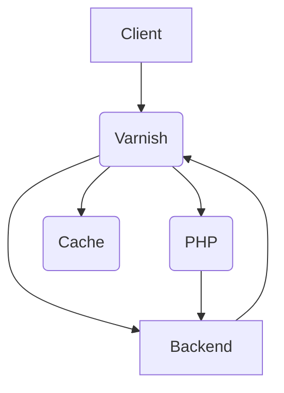

# flagship-x-varnish-cache
## Flagship x Varnish VCL Config
Varnish HTTP reverse proxy enables page caching, here's how to use this capability with Flagship.io

## Introduction

Even the most powerful servers sometimes need a good cache strategy. Handling hundreds of thousands of requests per second is not an easy thing to do. It can be a waste of time and energy if the computing result (HTML output in our case) is always the same. Using Flagship to personalize your App Experience per user (1:1) can break this strategy at first, but no worries, we got your back! By adapting your cache strategy, you'll be able to use Flagship and its superpowers.

This repo provides a cache flow solution using Varnish. You will find:

- A Docker Compose File `docker-compose.yaml`, containing a Varnish container and (usually comes with) a PHP container
- VCL files, including a default VCL config `default.vcl` (used by our Docker container) and some variation of it
- PHP files, handling 2 types of request (HTTP methods) `GET` and `HEAD`

To enable Flagship and Varnish to work as a team, we need to adapt our VCL config. The cache version will be mutualised, and the simple concept is to deliver the same cache to anyone who should see the same experience as others (A3S strategy). To do this, we need to let Varnish be aware of the current experience your user should see. We'll be using a header called `x-fs-experiences` as the cache key.

For every unknown user (every user that comes for the first time), we'll ask Varnish to transform the backend request to a HEAD request. Thus, we only care about backend response headers. This enables you to receive a dedicated request to retrieve your user data (anonymous user/logged and its related attributes) and ask Flagship to make a decision. The purpose of this process is only to return two headers: `x-fs-visitorId` and `x-fs-experiences`. Please note that you could also choose to use a dedicated backend server for this specific, simple, and blasting fast task. Either you use your current backend for that or another one only for this purpose.

## Optout & Emergency Stop

We created this strategy with the idea that you should be able to stop this process easily. Therefore, the user, Varnish, and PHP recognize an optout. If something goes wrong on the backend (HEAD request), simply return `x-fs-experiences: optout`. If this case happens, your user will see the "global cache," just like if Flagship wasn't there at all. This way, everything's safe.

## Warnings & Considerations

The total size of your cache will depend on how many use-cases your users can be assigned to. Thankfully, we do provide some help on the Flagship side. Check out our `Bucket Allocation` feature ([more details here](#bucket-allocation)). This might help!

## Varnish Flow Diagram

The following Mermaid Markdown diagram shows the Varnish flow:

## Contributing

We welcome contributions to this project. Feel free to open an issue or submit a pull request.

## License

This project is licensed under the Apache License 2.0. See the [LICENSE](LICENSE) file for details.
